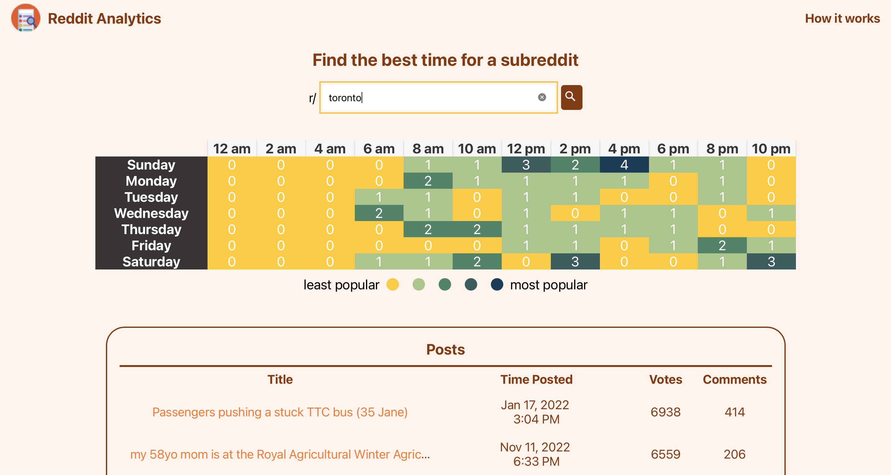

# Reddit Analytics App


## Description  
React application for searching and analyzing the top 100 posts in a subreddit. The app illustrates the ideal date and time of the week to create a post in a heatmap. This analytic information is useful to improve the chances of posts being liked more.



    
## Table of Contents   
* [User Story](#User-Story)
* [Acceptance Criteria](#Acceptance-Criteria)
* [Installation](#Installation)
* [Usage](#Usage)
* [Credits](#Credits)
* [License](#License)
* [Questions](#Questions)

## User Story

* As a user, I want to be able to search subreddits and obtain information of the best period of the week to create a post. 

## Acceptance Criteria

```
GIVEN a Reddit Analytics Application
WHEN I open the Reddit Analytics App
THEN I am presented with a welcome page with a searchbar
WHEN I enter the title of a subreddit and click on the search button
THEN I am presented with a heatmap graph and a list of top 5 posts
WHEN I click on a post link
THEN a new tab linked to the selected post opens up
```

## Installation
1. Clone the repo.
2. Navigate to the project directory.
3. Run command ```npm install``` to install any dependencies.

## Usage    
* Navigate to [Reddit Analytics Site](https://reddit-analytics.onrender.com).
* Enter the name of a subreddit on the searchbar.
* Click on the search button.

## Credits
Developed by: 
Manuel Leung Chen ([GitHub](https://github.com/manuelleungchen))

Tools used to Develop this MERN stack application: 

* [React.js](https://reactjs.org/)
* [Node.js](https://nodejs.org/en/)
* [Reddit API](https://www.reddit.com/dev/api/)
* [Render](https://render.com/)

## License
Copyright (c) 2020 - Manuel Leung Chen

Licensed under the [MIT License](https://choosealicense.com/licenses/mit/).
 

## Questions
Manuel Leung Chen - [GitHub](https://github.com/manuelleungchen )

If you have any question about this application, please reach out me by [Email](manuel.leungchen@gmail.com)

